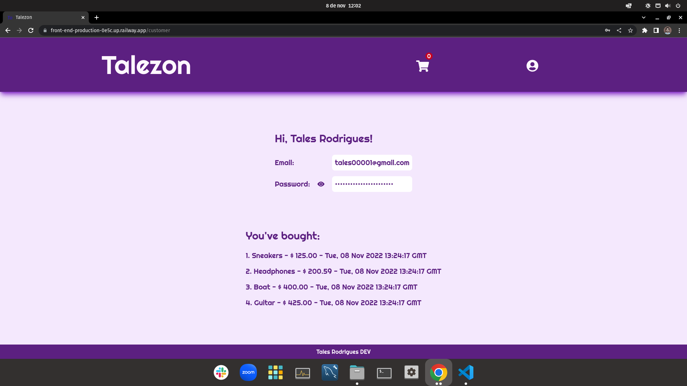

# Talezon

   

## Setup

1.
```
git clone git@github.com:talesrodriguesDEV/talezon.git
```

2. Environment variables

.env.example -> .env 

3. Backend Setup
```
cd backend
docker-compose up -d
docker exec -it talezon_api bash
npx sequelize-cli db:create && npx sequelize-cli db:migrate && npx sequelize-cli db:seed:all
npm start
```

4. Frontend Setup
```
cd frontend
npm start
```
